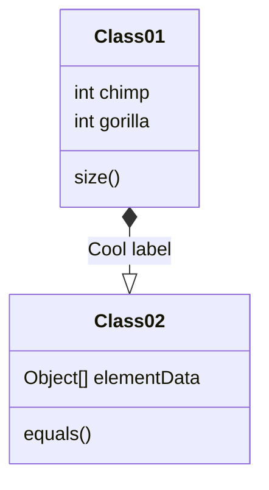
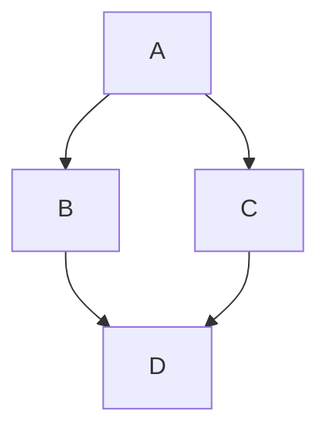
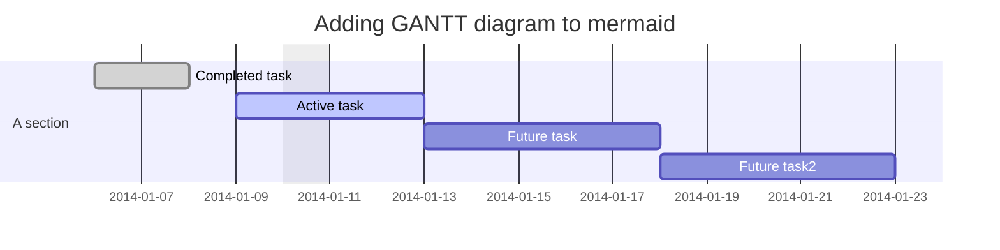
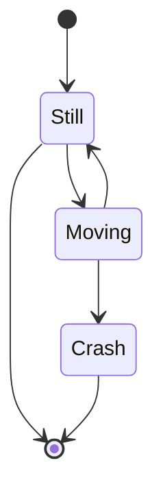
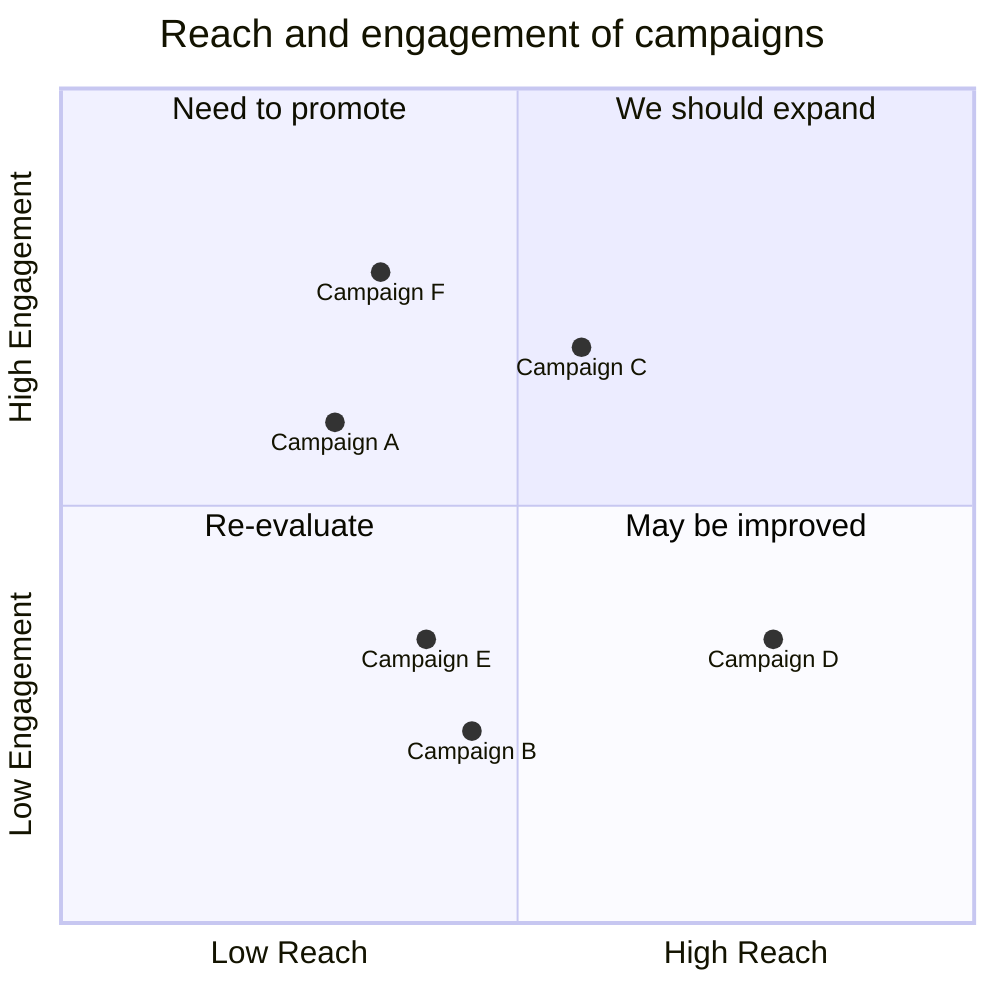
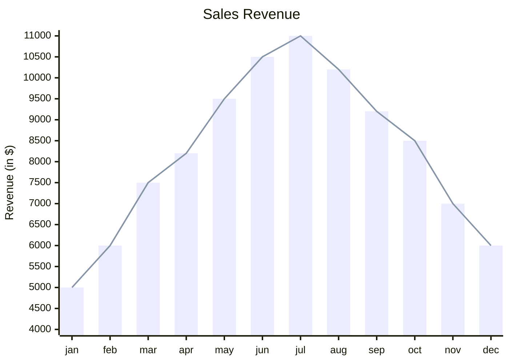

# Mermaid Diagrams
JavaScript based tool for creating charts and diagrams based on code/markdown that can be rendered in many environments such as Obsidian, GitHub, etc.

[Reference: Diagram Types](https://mermaid.js.org/intro/#diagram-types)

## Examples 
### Class Diagram

### Flowchart

### Gantt Chart

### State Diagram

### Quadrant Chart

### XY Chart

